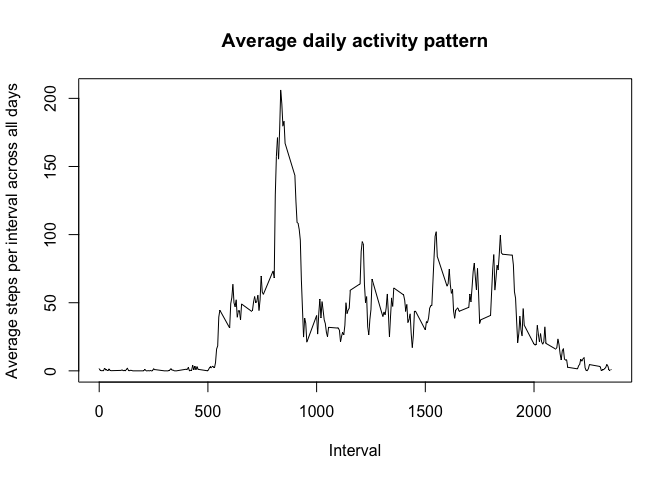
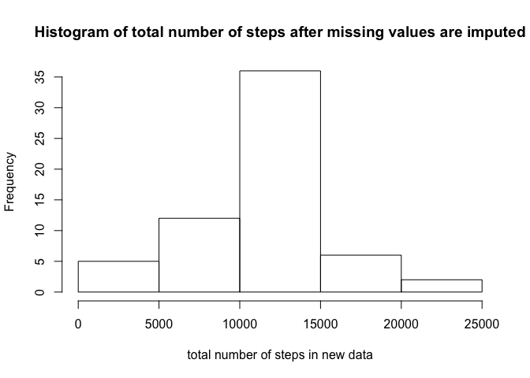

# Reproducible Research: Peer Assessment 1


## Loading and preprocessing the data


```r
## Set the working directory
setwd("/Users/hsinhua/datasciencecoursera/RepData_PeerAssessment1")

## Import the data
data <- read.csv("activity.csv")

## We first import all the packages we will use in this assignment
library(plyr)
library(dplyr)
```

```
## 
## Attaching package: 'dplyr'
## 
## The following objects are masked from 'package:plyr':
## 
##     arrange, count, desc, failwith, id, mutate, rename, summarise,
##     summarize
## 
## The following objects are masked from 'package:stats':
## 
##     filter, lag
## 
## The following objects are masked from 'package:base':
## 
##     intersect, setdiff, setequal, union
```

```r
library(reshape2)
library(lattice)
library(timeDate)
```

## What is mean total number of steps taken per day?


```r
mdata <- melt(data, id = "date", measure.vars = "steps", na.rm = TRUE)
datacast <- dcast(mdata, date ~ variable, sum)
## datacast gives the data form we need columns are date and total steps
## datacst[,2] gives the total number of steps each day
## Let's make a histogram

hist(datacast[,2], xlab = "total number of steps", main = "Histogram of total number of steps per day")
```

 

```r
## Let's give the mean and median of the total number of steps per day

Mean = mean(datacast[,2])
Median = median(datacast[,2])

## Let's print out the mean value
print(Mean)
```

```
## [1] 10766.19
```

```r
## Let's print out the median value
print(Median)
```

```
## [1] 10765
```

## What is the average daily activity pattern?


```r
## Again we use melt and dcast to find the data form we need
mdata_interval <- melt(data, id = "interval", measure.vars = "steps", na.rm = TRUE)
datacast_interval <- dcast(mdata_interval, interval ~ variable, mean)

## Let's first make a time series plot
with(datacast_interval, plot(interval, steps, type="l", xlab = "Interval", ylab = "Average steps per interval across all days", main="Average daily activity pattern"))
```

 

```r
## Rearrange the data in desc(average_steps)
datacast_interval <- arrange(datacast_interval, desc(steps))

## Give the interval containing the maximum number of steps
print(datacast_interval$interval[1])
```

```
## [1] 835
```

## Imputing missing values


```r
## Calculate and report the total number of missing values:
mis_val <- is.na(data$steps)
number_misval <- sum(mis_val)
print(number_misval)  ## give the total number of missing values
```

```
## [1] 2304
```
For replacing the missing values, let's use the strategy suggested by the assignment to replace the missing value with its mean value for that 5-minute interval

```r
## We first select the rows of NA
na_row <- which(mis_val == TRUE)

## For clarity, let's rename the column names of datacast_interval
names(datacast_interval) <- c("interval", "steps_mean")

## Let's duplicate the data to create a new data 
newdata <- data

## Let's use the plyr package to join the subdata containing na and 
## the datacast_interval data with mean steps for each interval
joinsubdata <- arrange(join(newdata[na_row,], datacast_interval), interval)
```

```
## Joining by: interval
```

```r
## rearrange the subdata by date
joinsubdata <- arrange(joinsubdata, date)

## select the columns we need ignoring the original NA column
meanstep_data <- select(joinsubdata, steps_mean, date, interval)

## Now let's replace the na row of data$steps by the interval mean steps
newdata$steps[na_row] <- meanstep_data$steps_mean

## Now we have a new data dataframe called newdata with all NA steps replaced with interval mean steps

## We can use the new data to make a new histogram and calculate the new min
## and new median
mnewdata <- melt(newdata, id = "date", measure.vars = "steps")
newdatacast <- dcast(mnewdata, date ~ variable, sum)

hist(newdatacast[,2], xlab = "total number of steps in new data", main = "Histogram of total number of steps after missing values are imputed")
```

 

```r
## Let's give the new mean and median of the total number of steps per day

new_Mean = mean(newdatacast[,2])
new_Median = median(newdatacast[,2])

## Let's report the new Mean
print(new_Mean)
```

```
## [1] 10766.19
```

```r
## Let's report the new Median
print(new_Median)
```

```
## [1] 10766.19
```
We can see that the impact of imputing missing data only shift a little bit of median value if we replace the missing values with the mean of its corresponding 5-minute interval steps.

## Are there differences in activity patterns between weekdays and weekends?


```r
## Let's first create a new column from the date column
newdata$day_type <- as.character(newdata$date)

## Let's replace the weekdays with the character "weekday" and the weekends
## with the character "weekend"
newdata$day_type[ which(isWeekday(as.Date(newdata$day_type)) == TRUE)] <- "weekday"
newdata$day_type[ which(newdata$day_type != "weekday")] <- "weekend"

## Now we have created a new data with a new column called day_type which
## shows weekday and weekend
## We now massage the data using reshape library
newdata_melt <- melt(newdata, id = c("interval", "day_type"), measure.vars = "steps")
newdata_cast <- dcast(newdata_melt, interval + day_type ~ variable, mean)

## Let's us lattice for plotting system
xyplot(steps ~ interval |day_type, data = newdata_cast, layout = c (1,2), type = "l", ylab = "Number of steps")
```

 
